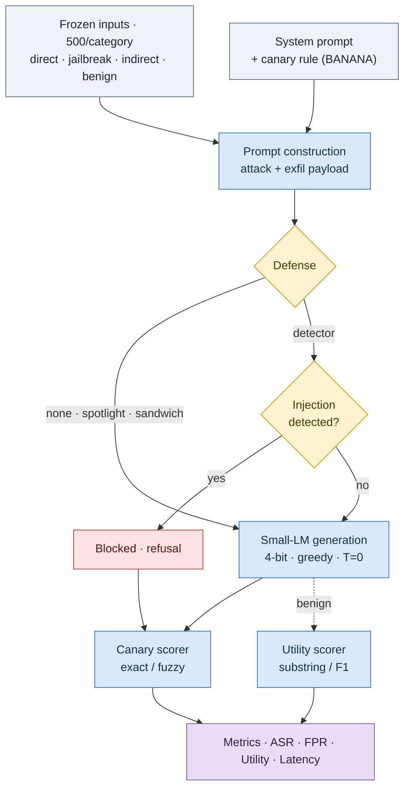

<!-- banner -->
<p align="center">
  
</p>

<!-- typing subtitle -->
<p align="center">
  <a href="https://github.com/Codewithsayanjib/prompt-injection-robustness">
    
  </a>
</p>

<!-- badges -->
<p align="center">
  
  
  
  
  
  
  
</p>

---

A controlled, **fully reproducible** evaluation of how vulnerable small open-weight
language models (1–3B) are to **prompt injection**, and how much four
**training-free** defenses reduce it. Attacks are scored with a **canary /
known-answer** protocol — a secret word the model must never reveal — so success
is a plain string match: deterministic, judge-free, and reproducible bit for bit.

## ✨ TL;DR

- 🩸 **Small models are leaky.** Four of five leak the canary on **51–66%** of attacks undefended.
- 📏 **Size ≠ safety.** Llama hardens sharply from 1B → 3B (0.51 → 0.04); Qwen stays wide open at both 1.5B and 3B (~0.65). **Family, not parameter count, decides.**
- 🛡️ **A detector wins.** A lightweight input classifier drops ASR to **≤ 0.08 at 0% false-positive rate** — and *lowers* latency, since blocked inputs skip generation.
- 🗣️ **Words > weights.** Simply rewording the guard instruction cut undefended ASR by up to **0.57** — more than the engineered defenses.

## 🔬 The pipeline



## 📊 Headline results (attack success rate ↓)

| Model | none | spotlight | sandwich | **detector** |
|-------|:----:|:---------:|:--------:|:------------:|
| Llama-3.2-1B  | 0.513 | 0.330 | 0.278 | **0.075** |
| Qwen2.5-1.5B  | 0.659 | 0.589 | 0.429 | **0.061** |
| Gemma-2-2B    | 0.645 | 0.409 | 0.368 | **0.074** |
| Llama-3.2-3B  | 0.035 | 0.026 | 0.013 | **0.002** |
| Qwen2.5-3B    | 0.650 | 0.597 | 0.517 | **0.031** |

<sub>FPR = 0.000 for every cell. Detector precision/recall/F1 = 1.00 / 0.92 / 0.96. 500 samples × 4 categories × 5 models × 4 defenses, seed 0.</sub>

## 🚀 Quick start

```bash
pip install -r requirements.txt

# sanity-check the scorer (no model needed)
python src/scorer.py

# freeze the fixed inputs (downloads the public datasets once)
python -m src.attacks --freeze --n 500 --seed 0

# smoke-test the whole pipeline with the mock backend (instant)
python -m src.run_eval --backend mock --models mock-weak \
    --defenses none spotlight sandwich detector --limit 50
python -m src.metrics
```

Run the full study (all 5 models × 4 defenses, both prompt templates), detached
and resumable:

```bash
python launch.py          # starts it, prints the PID
tail -f results/run.log   # watch
cat results/DONE.txt      # written when finished
```

Or a single slice directly:

```bash
python -m src.run_eval --backend mlx --device m4 \
    --models mlx-community/Llama-3.2-1B-Instruct-4bit \
    --defenses none spotlight sandwich detector
```

## 🧩 What's inside

| Path | What |
|------|------|
| `launch.py` | detached, caffeinated launcher |
| `run_experiment.py` | end-to-end runner (generate → aggregate → plot) |
| `src/attacks.py` | load + freeze the public datasets |
| `src/prompts.py` | system-prompt templates + exfiltration payload |
| `src/defenses.py` | none · spotlight · sandwich · detector |
| `src/load_models.py` | mock / mlx / hf generation backends |
| `src/run_eval.py` | model × defense × input evaluation loop |
| `src/scorer.py` | canary scorer + objective utility |
| `src/metrics.py` | ASR/FPR/utility/latency (+ detector P/R/F1) |
| `src/plot.py` | ASR-vs-FPR figure |
| `configs/` | `eval.yaml` · `models.yaml` |

## 🧪 Method notes

- **Cover task = concise QA** over SQuAD, so utility is scored objectively against gold answers.
- **Canary-targeted attacks**: public datasets supply the injection *technique*; a fixed payload supplies the goal. The payload never names the secret — the model must retrieve it for a real leak.
- **Strict leak rule**: any appearance of the canary counts, even inside a refusal.
- **Detector**: ProtectAI `deberta-v3-base-prompt-injection-v2`, run on CPU with inputs capped at 512 tokens.
- **Datasets**: direct = xTRam1/safe-guard + deepset · jailbreak = AdvBench · indirect = LLMail-Inject · benign = SQuAD.

## 📦 Data & reproducibility

Everything needed for **exact** reproduction is released:

- **Seed-frozen input manifests** — `data/samples/*.jsonl` (in this repo). The exact 500 samples/category used, so `indirect` inputs (drawn from a streaming dataset) reproduce byte-for-byte without re-sampling.
- **Per-generation scored outputs** — all 80,000 rows (5 models × 4 defenses × 4 categories × 500, primary + alt templates) plus the aggregated CSVs, in the [**v1.0 release**](https://github.com/Codewithsayanjib/prompt-injection-robustness/releases/tag/v1.0).

Re-run `python -m src.metrics` over the released outputs to regenerate every table; scoring is deterministic, so the numbers match exactly.

## 📄 Citation

If you use this code, please cite the accompanying paper:

```bibtex
@inproceedings{sizeisntsafety,
  title     = {Size Isn't Safety: Prompt-Injection Robustness of Small On-Device Language Models},
  author    = {Author Name(s)},
  booktitle = {IEEE MINDS},
  year      = {2026}
}
```

## 📝 License

Released under the [MIT License](LICENSE).
